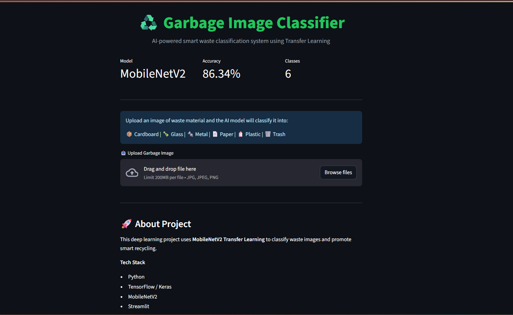
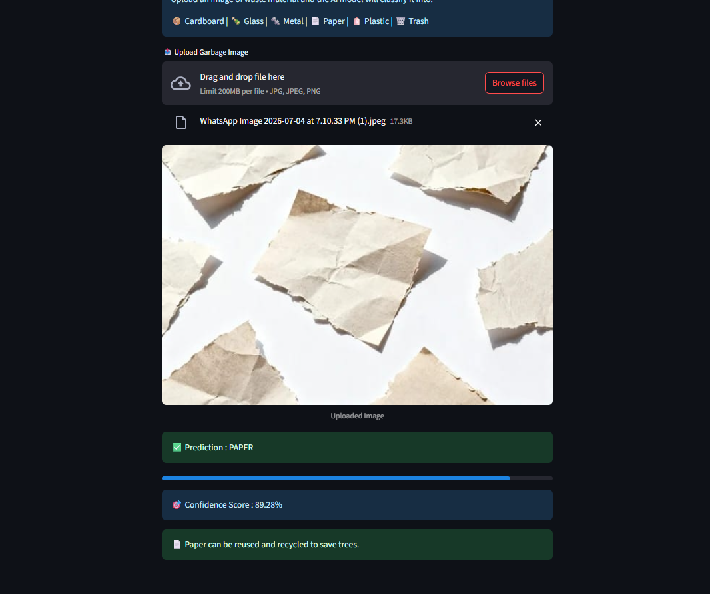

# ♻️ Garbage Image Classifier

<div align="center">

## AI-Powered Smart Waste Classification System using Deep Learning

A deep learning based application that classifies waste images into different categories and helps promote efficient recycling using Artificial Intelligence.

Built as part of my learning journey during the **Edunet Foundation Internship** and later upgraded with a production-ready ML pipeline.

</div>


---

## 📌 Overview

Waste management is an important environmental challenge.  
This project uses **Deep Learning and Computer Vision** to automatically classify garbage images into different waste categories.

The system allows users to upload an image of waste material, analyzes it using a trained AI model, and predicts the category along with a confidence score and recycling suggestion.

---

## 🚀 Live Demo

🔗 **Application Link:**  
[live link](https://garbage-classifier-vk18.streamlit.app/)

---

## 📸 Application Screenshots

### Homepage




### Prediction Result




---

# ✨ Features

✔️ Upload garbage images  
✔️ AI-based waste classification  
✔️ Confidence score visualization  
✔️ Recycling suggestions  
✔️ Fast prediction system  
✔️ Clean Streamlit user interface  
✔️ REST API support using FastAPI  


---

# 🧠 Classification Categories

The model classifies waste into **6 categories**:

| Category | Description |
|---|---|
| 📦 Cardboard | Boxes, packaging material |
| 🍾 Glass | Glass bottles/items |
| 🔩 Metal | Cans, metallic waste |
| 📄 Paper | Paper waste |
| 🧴 Plastic | Plastic bottles/items |
| 🗑️ Trash | General waste |


---

# 🤖 Machine Learning Model

The first version of this project used a basic CNN model, but it struggled with real-world images.

The upgraded version uses:

### MobileNetV2 Transfer Learning

Architecture:

```
Input Image
      |
      ↓
Image Augmentation
      |
      ↓
MobileNetV2 Feature Extractor
      |
      ↓
Global Average Pooling
      |
      ↓
Dropout Layer
      |
      ↓
Softmax Classifier
      |
      ↓
Waste Category
```

---

## 📊 Model Performance

Final Model Accuracy:

```
Training Accuracy   : 86%+
Validation Accuracy : 86.34%
```

Improvements:

- Better generalization
- Real-world image support
- Transfer learning
- Strong image augmentation


---

# 🛠️ Tech Stack

## Machine Learning

- Python
- TensorFlow
- Keras
- MobileNetV2
- Transfer Learning


## Backend

- FastAPI
- Uvicorn


## Frontend

- Streamlit
- HTML/CSS


## Deployment

- Streamlit Cloud


---

# 📁 Project Structure


```
Garbage-Classifier-Project/

│
├── backend/
│   ├── main.py
│   ├── predict.py
│   └── requirements.txt
│
├── frontend/
│   ├── app.py
│   └── streamlit_app.py
│
├── model/
│   ├── model.keras
│   └── label_map.json
│
├── notebooks/
│   └── training.ipynb
│
├── utils/
│   └── preprocessing.py
│
├── extra/
│   └── screenshots/
│
├── requirements.txt
├── README.md
└── .gitignore
```


---

# ⚙️ Installation & Setup


Clone repository:

```bash
git clone https://github.com/deepakjha018/Garbage_Classifier_Project.git
```


Move into project:

```bash
cd Garbage_Classifier_Project
```


Install dependencies:

```bash
pip install -r requirements.txt
```


Run Streamlit app:

```bash
streamlit run frontend/streamlit_app.py
```


---

# 🌐 API Usage (Optional)

Start FastAPI server:

```bash
cd backend

uvicorn main:app --reload
```


API endpoint:

```
POST /predict
```

Upload an image and receive:

```json
{
    "prediction":"plastic",
    "confidence":95.6
}
```


---

# 🔮 Future Improvements

- Add more waste categories
- Improve dataset diversity
- Add object detection support
- Create mobile application
- Deploy FastAPI separately


---

# 🎓 Internship

This project was initially developed during:

**Edunet Foundation Internship Program**

Later enhanced with:

- Transfer Learning
- Improved ML pipeline
- Better UI
- Deployment-ready architecture


---

# 👨‍💻 Developer

**Deepak Kumar Jha**

AI & Data Science Student

Passionate about Machine Learning, Data Science, and AI-powered solutions.


---

⭐ If you like this project, consider giving it a star!
